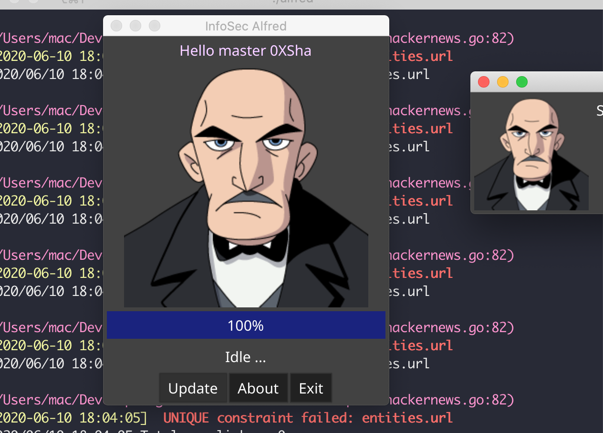
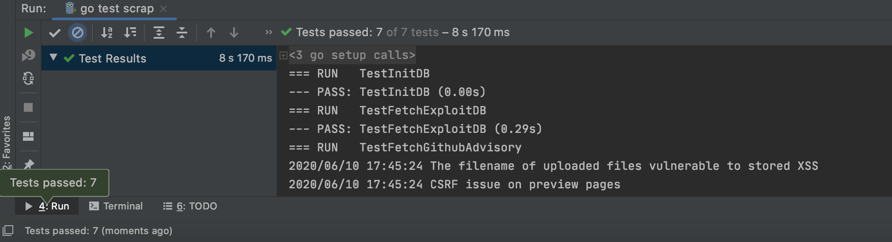
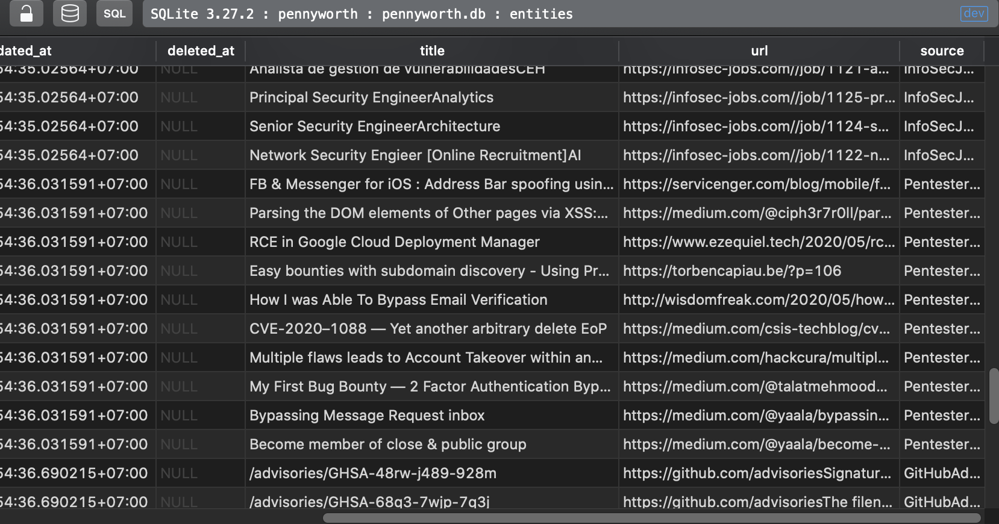

# Infosec-Alfred
The repo created for this  [write-up](https://0xsha.io/posts/the-art-of-automation-creating-your-own-alfred). It is named after Alfred Pennyworth in the Batman series. 
Alfred is a cross-platform web scraping tool. 
It will automatically scrap information security related sources with a single click.
It will store the data inside SQLite3 Database.<br><br>


# Version
1.0.2-alpha


# Installation and Usage
```
git clone this repo
cd repo
cd cmd 
go build -o alfred .
```
Please note due to its nature, a change in sources UI can break a module you can run tests to find out what's broken. 
```
cd repo
go test ./scrap
```
After first run you can change the master name inside pennyworth.db

# Motivation 
- Case study for various scraping techniques. 
- Case study for this  [write-up.](https://0xsha.io/posts/the-art-of-automation-creating-your-own-alfred)
 
- Fun


# Screenshots: 

<br><br>
<br><br>
<br><br>


# Demo:

[](https://www.youtube.com/watch?v=Lyd8QTx-eGw)


# Sources:
Alfred, in the current version, scrap these sources.

- Exploit-Db
- Github-Advisory
- Reddit-NetSec
- HackerOne-Hacktivity
- NewsApi with these keywords:
 - `{"0-day", "hacker",  "data-breach" , "bug-bounty" ,"vulnerability" , "malware"}`
- TheHackerNews
- PentesterLand 


# How to contribute


- Add a module or fix something and then pull request.
- The endless possibility of improvements:
    - Add a new module 
    - Fix or update a module 
    - Add a neat future
- Share it with whomever you believe can use it.
- Do the extra work and share your findings with the community.


